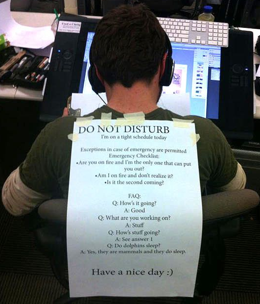

### Chapter 1: The Problem

Our modern work life is nothing short of a circus. Notifications pinging left, right, and centre. Back-to-back meetings that eat up your day. A noisy office buzzing with random conversations. It’s chaos. And honestly, how are we supposed to get anything done in this kind of madness?

Think about it: Every time someone interrupts you—whether it’s a phone notification or a colleague swinging by your desk—it’s like hitting the reset button on your brain. You’ve got to stop, switch gears, and then spend ages trying to get back to what you were doing.

And don’t even get me started on meetings. Half of them could’ve been an email. But instead, we’re stuck in these endless discussions that leave us wondering what exactly got achieved.

The result? You’re constantly “busy” but never feel like you’re making real progress. Creativity? Forget it. Focus? What’s that?

### Chapter 2: The Impact

This constant whirlwind of interruptions isn’t just annoying—it’s exhausting. You’re jumping from one thing to another all day, barely able to finish what you started. And by the end of the day, you’re knackered, not because you achieved a lot, but because you spent all your energy just trying to stay afloat.

Burnout creeps in before you know it. Your mind feels cluttered, your creativity is out the window, and you start dreading the very work you once enjoyed. And when you’re stuck in this endless loop of distractions, it’s not just your productivity that takes a hit—your mental peace goes for a toss too.

But here’s the good news: You don’t have to live like this. There’s a better way to work, and it starts with taking control of your time.

### Chapter 3: The Solution

Living asynchronously is all about working on your own terms. No more reacting to every ping or rushing to every meeting. You get to decide when and how you work best. Let me show you how to make it happen.

### References

1. Newport, Cal. "Deep Work: Rules for Focused Success in a Distracted World." Grand Central Publishing, 2016.
2. Quincy Larson's "Live Asynchronously." FreeCodeCamp, 2016 - [FYR](https://www.freecodecamp.org/news/live-asynchronously-c8e7172fe7ea/)
